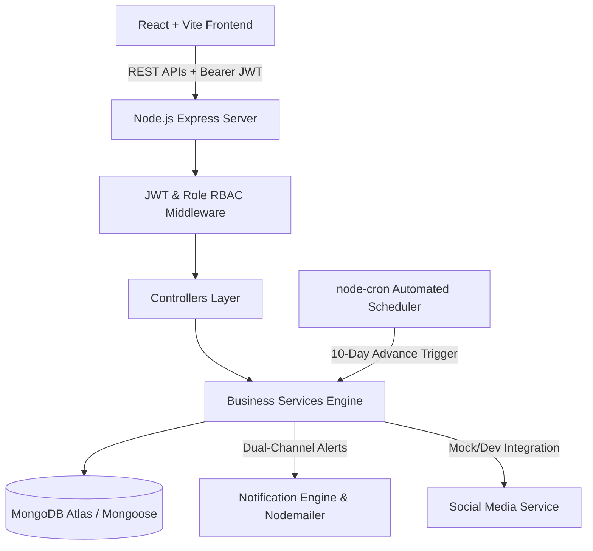

# JeevanSetu System Architecture

JeevanSetu is built on a decoupled, modular, full-stack architecture with a state-driven automated procurement engine.

## High-Level Architecture Diagram

## Layered Architecture Responsibilities

1. **Presentation Layer (`frontend/`)**: Built using React 18, Vite, Tailwind CSS, Recharts, and React Router. Provides role-filtered dashboards for Patient, Doctor, Blood Bank, Donor, Hospital Management, and Admin.
2. **REST API Layer (`backend/routes/` & `controllers/`)**: Thin controllers validating request payloads and delegating complex state transitions to services.
3. **Business Logic Layer (`backend/services/`)**:
   - `bloodSearchService.js`: Level 1-4 pre-transfusion procurement pipeline.
   - `bloodMatchingService.js`: Blood compatibility matrix donor matching engine.
   - `transfusionScheduler.js`: Predictive T-10 upcoming transfusion scanner.
   - `notificationService.js`: In-app notification logger and Nodemailer email dispatch.
   - `socialMediaService.js`: Social campaign abstraction with mock development mode.
4. **Data Layer (`backend/models/`)**: Mongoose schemas enforcing constraints, unique indexes, and referenced relational integrity.
